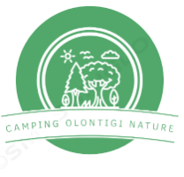
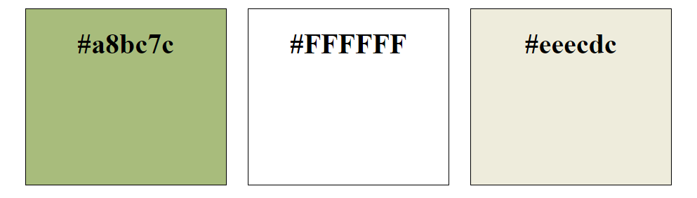

# Camping Olontigi Nature

*"Descubre la belleza de la naturaleza"*

## Breve descripción del proyecto
Mi proyecto tiene como propósito la creación de una página web para modernizar la presencia en línea de un camping. Nuestro objetivo principal será dar una experiencia de usuario atractiva y dinámica ofreciendo una plataforma interactiva que intente plasmar la belleza y oportunidades que este destino tiene para brindar a sus clientes.

## Logo 

He optado por este logo para intentar transmitir a los posibles clientes un mensaje positivo sobre la experiencia de la que podrán disfrutar en el camping: un entorno natural, pacífico y lleno de actividades para disfrutar al aire libre.

## Colores
He elegido los siguientes colores para nuestra página:
+ **Verde**: Al ser un color asociado con la naturaleza y la frescura. Será el color dominante para transmitir la sensación de tranquilidad, serenidad y de estar en un entorno natural.
+ **Blanco**: Para destacar la claridad y la limpieza, lo que es esencial en un camping donde se espera un entorno limpio y ordenado.
+ **Gris**: He elegido el gris como tercer color, porque lo considero un color neutral que puede ser un buen complemento para los colores anteriormente mencionados.



[Documento HTML](html/colores.html)

```html
<!DOCTYPE html>
<html lang="en">

<head>
    <meta charset="UTF-8">
    <meta name="viewport" content="width=device-width, initial-scale=1.0">
    <title>Colores Elegidos</title>
    <link rel="stylesheet" type="text/css" href="../css/colores.css">

</head>

<body>
    <div class="contenedor">
        <div class="verde">
            <h1>#a8bc7c</h1>
        </div>
        <div class="blanco">
            <h1>#FFFFFF</h1>
        </div>
        <div class="gris">
            <h1>#eeecdc</h1>
        </div>
    </div>
</body>

</html>

```
[Documento CSS](css/colores.css)

```css
.contenedor {
    width: 100%;
    max-height: 1000px;
    justify-content: space-around;
    top: 50%;
    align-items: center;
    text-align: center;
}

.contenedor>div {
    border: 1px solid black;
    width: 15%;
    height: 200px;
    display: inline-block;
    margin: 10px;
}

.verde {
    background-color: #a8bc7c;
}

.blanco {
    background-color: #FFFFFF;
}

.gris {
    background-color: #eeecdc;
}

```

## Alojamientos
+ **Parcelas para tiendas de campaña y caravanas**
+ **Alquiler de caravanas**
+ **Alquiler de tiendas de campaña**
+ **Cabañas**

## Instalaciones
Entre nuestras instalaciones contamos con:

+ **Bar cafetería**
+ **Piscina infantil y para adultos**
+ **Baños y duchas públicas**
+ **Recepción**
+ **Pistas de pádel, tenis, campo de fútbol, baloncesto y ping pong**
+ **Supermercado**


## Actividades
Para aprovechar al máximo su estancia le brindamos a nuestros clientes las siguientes actividades:

+ **Senderismo en rutas naturales**
+ **Pesca en nuestros lagos y ríos**
+ **Fogatas y noches de estrellas**
+ **Rutas en kayak**
+ **Cicloturismo**
+ **Rocódromo infantil**

